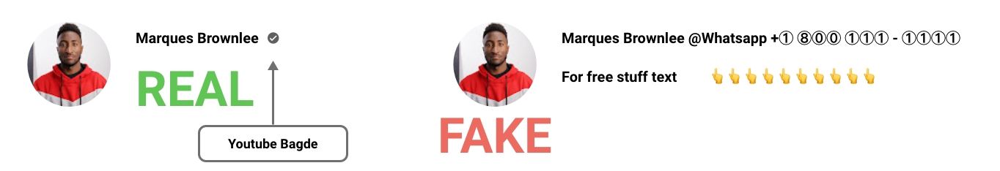
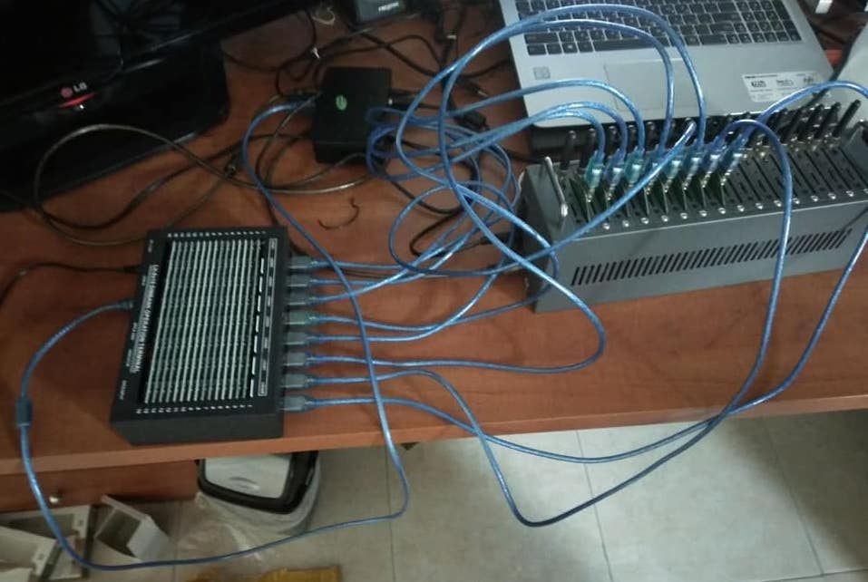

[English](README.md) ∙ [Français](README-fr.md)

# Solution to avoid social media scam

## Information
> This Github article, have been created to protect the world agains scam throw social media.
> 
> DO NOT USE THIS ARTICLE FOR ILLEGAL PURPOSES.

## Learn how scammers works
Many scammers come from third world countries (e.g. Nigeria, Romania, India, Russia, China) this is a list from known region but they could be found in evry location on the planet. Scammer are alwase looking for solution to scam other throw social media. They should learn adapt quiclky because they know Youtube, facebook and other platform find solution. 

## Understending the pattern 
On Youtube or Tiktok Scammers ofter reply to a person who place a comment on a video. The comment or the username often containe a phone nmber from a contry other than USA (if you Youtuber/TikToker live in USA). The number is often separated by a special character, see bellow:

> +1 (888) 123-4567 (The number) to avoid being caught the scammer number become like this ∙+∙1∙∙(∙8∙8∙8∙)∙1/∙∙2/∙∙3∙-∙4∙5∙6∙7∙

They clame to have somme private givaway of expensive product such as phone, tablet or laptops. After a quick discussion throw Telegram or WhatsApp they inform you that you are the sellected candidate who will the product and you only have to pay the shipping fees. 

The profile picure is often the same as the creator with a similar name, sometime the username name, have a phone number with a platform of chating (WhatsApp or Telegram).  

From the image, you can see that Youtube, Twitter, instagram, tiktok have created a badge to identify the popular personality. 

To learn more about the badge checkout those articles:
#### Youtube: https://support.google.com/youtube/answer/3046484
#### Twitter: https://help.twitter.com/en/managing-your-account/about-twitter-verified-accounts
#### Instagram: https://help.instagram.com/733907830039577/

## How to make bulk account
Scammers know that fraud it's agains the social media turm of use. The Social Media app, ofter use [Two-Factor Authentication (2FA)](https://authy.com/what-is-2fa/) in order to make the task harder for scammers. Scammer have found other solutions one of them is VOIP. There are some IOS and Android apps like [Textenow](https://www.textnow.com/) that let you generate a USA and Canada phone number for free using [Voice over IP (VOIP)](https://www.fcc.gov/general/voice-over-internet-protocol-voip). If some companies only accept SMS, It is also possible to use a prepaid [SIM card](https://www.easytechjunkie.com/what-is-a-prepaid-sim-card.htm) with a [GSM modem](https://nowsms.com/faq/what-is-a-gsm-modem) and send SMS over 3G, or it is possible to use services that do the same with an [API](https://www.howtogeek.com/343877/what-is-an-api/) such as [PVACodes](https://pvacodes.com/)  

## That solution slould be made to avoid having 

1. Block special character that have Unicode Code Point numbers U+2460 to U+2473 + U+24EA. [See this article](https://altcodeunicode.com/alt-codes-circled-number-letter-symbols-enclosed-alphanumerics/)
2. Block username with Whatapp telegram or other same. 
3. Username should be first come, first served no duplicate Username.
4. Youtube and other Social Media app should make a section up protect the profile picture and no one is allowd to use it a bit with NFTs.
5. Block bulk Gmail, Facebook, Twitter, Tiktok account creation, by looking at the Browser [Fingerprinting](https://pixelprivacy.com/resources/browser-fingerprinting/) and not just the public IP address. Max one account per week.
6. Block Disposable email if is not alredy made.
7. Zero Tolerance, if someone report am email as scam and an emploee approve to be a scam. The user should be unable to comment like dislike on videos. 
8. Mass Comment slould be low down with a [Captcha](https://support.google.com/a/answer/1217728). When a user send 5 comment in the last 3000 ms (3 second) a captcha should appear. 
9. Using [Deep Learning](https://www.ibm.com/cloud/learn/deep-learning) a [scraping bot](https://www.parsehub.com/blog/what-is-web-scraping/) should be made to understend scammers pattern. 
10. Telegram, Whatapp and other encrypted chating platform slould make a button to reporte the message as scam.

# Contact info
Feel free to contact me to discuss any issues, questions, or comments.
